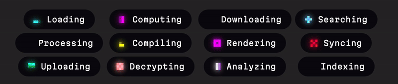

<div align="center">

# Pixel Bloom

**Animated 3x3 pixel grid indicators with Display P3 color support**



[Gallery](https://pupsarin.github.io/pixel-bloom) · [Playground](https://pupsarin.github.io/pixel-bloom/playground)

</div>

---

## Quick start

```bash
bun install
bun --hot ./index.ts
```

## Usage

```ts
import { bloom } from "./bloom.ts";

// Using preset names
const handle = bloom(container, {
  animation: "loading",
  color: "cyan",
});

// Using a custom config
const handle = bloom(container, {
  pattern: [[4], [1, 3, 5, 7], [0, 2, 6, 8]],
  stagger: 190,
  hold: 420,
  fade: 360,
  offset: 0,
  wrap: false,
  easing: "ease-out",
  srgb: [0, 255, 255],
  p3: [0, 0.92, 0.92],
});

// Control playback
handle.stop();
handle.start();
handle.destroy();
```

## API

### `bloom(container, config, startTime?): BloomHandle`

Appends a 3x3 grid to `container` and starts animating.

| Parameter | Description |
|---|---|
| `container` | Parent `HTMLElement` to mount into |
| `config` | Preset reference or full `BloomConfig` object |
| `startTime` | Optional shared `performance.now()` origin for syncing multiple instances |

### Config options

| Field | Type | Description |
|---|---|---|
| `pattern` | `number[][]` | Animation frames — each sub-array is a group of cell indices (0-8) that animate together |
| `stagger` | `number` | Delay in ms between each frame group |
| `hold` | `number` | Duration in ms a cell stays fully lit |
| `fade` | `number` | Duration in ms for the fade-out |
| `offset` | `number` | Time offset in ms (for staggering multiple instances) |
| `wrap` | `boolean` | Whether the animation wraps seamlessly or pauses between cycles |
| `easing` | `string` | Fade curve: `linear`, `ease-in`, `ease-out`, `ease-in-out` |
| `srgb` | `[r, g, b]` | sRGB color (0-255 per channel) |
| `p3` | `[r, g, b]` | Display P3 color (0-1 per channel) |

### `BloomHandle`

| Method / Property | Description |
|---|---|
| `start()` | Resume animation |
| `stop()` | Pause and clear cells |
| `destroy()` | Remove the grid from the DOM and stop |
| `active` | `boolean` — whether currently animating |

## Cell layout

```
0 1 2
3 4 5
6 7 8
```